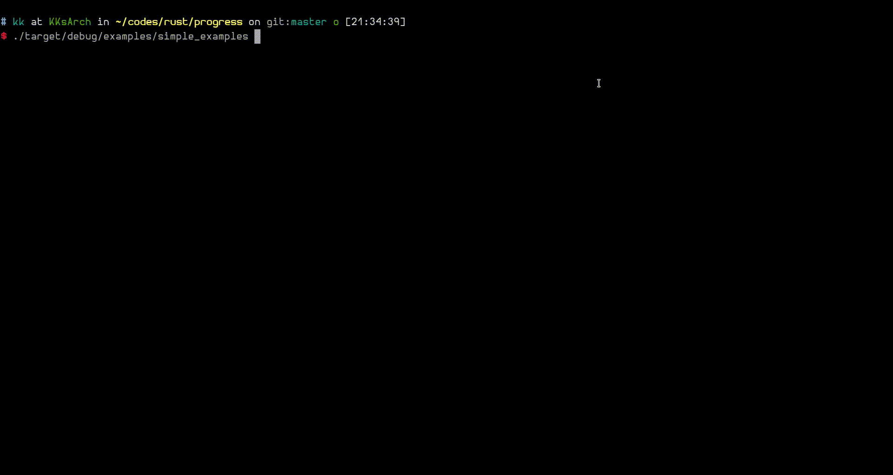

progress
========

**progress** is meant to be a set of useful tools for showing program running
progress (as its name) and steps. 

### [View the Rustdoc](https://TheKK.github.io/progress/progress)

Examples
========



Installation
============

Add the following lines to your `Cargo.toml` dependencies section, if you
use [Cargo.io](https://crates.io):

```
[dependencies]
progress = "0.1"
```

Or if you want to use this GitHub repo directly (warning: you'll download some
extra nonsense e.g. gifs), add following line to your `Cargo.toml`:

```
[dependencies]
progress = { git = "https://github.com/TheKK/progress.git" }
```

Usage
=====

Here shows you how to crate and use and progress bar.

``` rust
use std::thread;

extern crate progress;

let bar = progress::Bar::new();

bar.set_job_title("Working...");

for i in 0..11 {
    thread::sleep_ms(100);
    bar.reach_percent(i * 10);
}
```

Please check [documentations](https://TheKK.github.io/progress/progress) for
more detail.

Contribution
============

I can't believe you would say that, but if you have any great idea want to share
or any bug to report, don't be hesitate! It would be more wonderful if someone
wants to write some code for this project!

Who create this
===============

- [Ying-Ruei Liang (KK)](https://github.com/TheKK)

TODO list
=========

- BarBuilder, so we can do some customization, e.g. change the symbols used
- Add more type of indicators, e.g. spinning symbol or nayn cat :3
- Color/styled text support.
  - I currently use `print!("{:<50}")`, but it count unprintable text as well, I
  have to solve it first.
- Make output format customizable, despite I have no idea how to achieve this
for now (or shall we?).

License
=======

MIT, see [LICENSE](./LICENSE)
